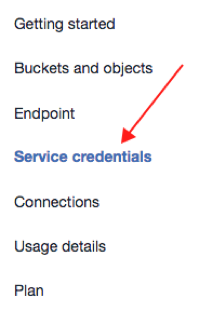
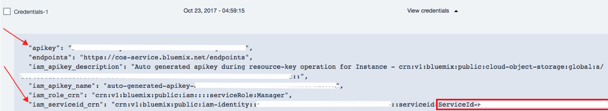
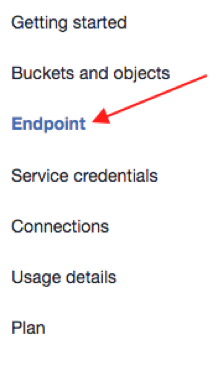

## Getting IAM keys:

1.  Go to COS service credentials page. Get the **apikey** and **service id**. The **service id** is the suffix of **iam\_serviceid\_crn** value, starting and including **ServiceId** as illustrated below:
 
  
  
  
2. Choose an **endpoint** from Endpoints Page, for example: **s3-api.us-geo.objectstorage.softlayer.net**:
  